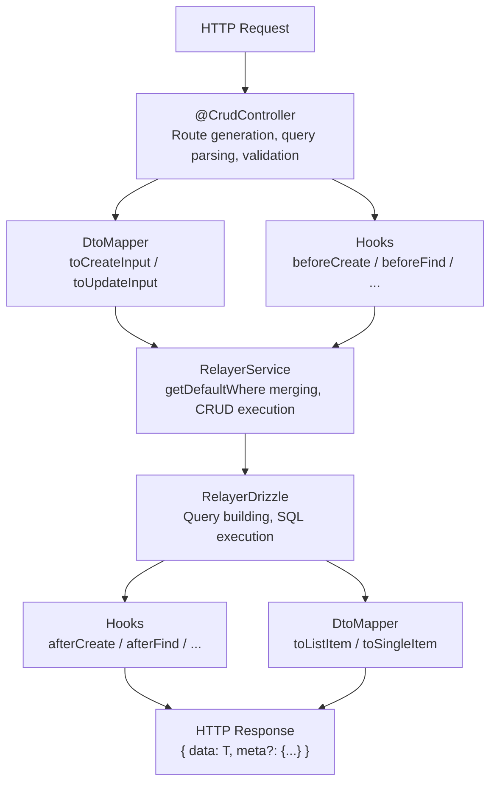

# @relayerjs/nestjs-crud

Full-featured CRUD for NestJS on top of [Relayer](https://github.com/awHamer/relayer), an ORM-agnostic database layer. Define a Drizzle schema, add an entity class, and get a production-ready REST API with first-class TypeScript types across every layer.

---

## Features

🧱 **Built on Relayer's core** — ORM-agnostic by design. Currently supports Drizzle ORM only, as we are in early development.

⚡ **Full-featured CRUD** — Turns your database schema into a first-class REST API with zero boilerplate.

🔥 **Complex filters and aggregations** — AND, OR, relations, JSON fields, any SQL-derived fields, and configurable search. Thanks to Relayer's nature, all fields are treated equally.

🎛️ **Full lifecycle control** — Hooks, data mappers, field-level access control.

🏗️ **First-class TypeScript** — Type-safe across all your entities, services, controllers, hooks, and responses.

## Table of Contents

- [Installation](#installation)
- [Quick Start](#quick-start)
- [Architecture](#architecture)
- [Service](#service)
- [Controller](#controller)
- [DtoMapper](#dtomapper)
- [Lifecycle Hooks](#lifecycle-hooks)
- [Query DSL](#query-dsl)
- [Aggregation](#aggregation)
- [Response Types](#response-types)
- [Relation Endpoints](#relation-endpoints)
- [Swagger](#swagger)
- [Validation](#validation)
- [Error Handling](#error-handling)
- [Dependency Injection](#dependency-injection)

## Installation

```bash
npm install @relayerjs/nestjs-crud @relayerjs/core @relayerjs/drizzle drizzle-orm
```

Peer dependencies: `@relayerjs/core`, `@relayerjs/drizzle`, `@nestjs/common`, `@nestjs/core`, `reflect-metadata`, `rxjs`.

## Quick Start

### 1. Define entities

```ts
// entities/post.entity.ts
import { createRelayerEntity } from '@relayerjs/drizzle';

import * as schema from '../schema';

export class PostEntity extends createRelayerEntity(schema, 'posts') {}
```

```ts
// entities/user.entity.ts
const UserBase = createRelayerEntity(schema, 'users');

export class UserEntity extends UserBase {
  @UserBase.computed({
    resolve: ({ table, sql }) => sql`${table.firstName} || ' ' || ${table.lastName}`,
  })
  fullName!: string;

  @UserBase.derived({
    query: ({ db, schema: s, sql, field }) =>
      db
        .select({ [field()]: sql<number>`count(*)::int`, userId: s.posts.authorId })
        .from(s.posts)
        .groupBy(s.posts.authorId),
    on: ({ parent, derived: d, eq }) => eq(parent.id, d.userId),
  })
  postsCount!: number;
}
```

### 2. Create an entity map

The entity map ties your entity classes together and enables cross-entity type inference:

```ts
// entities/entity-map.ts
export const entities = { users: UserEntity, posts: PostEntity };
export type EM = typeof entities;
```

### 3. Register the module

```ts
@Module({
  imports: [
    RelayerModule.forRoot({
      db,
      schema,
      entities: [UserEntity, PostEntity],
      baseUrl: () => `http://localhost:3000`,
    }),
    PostsModule,
  ],
})
export class AppModule {}
```

### 4. Create a service

```ts
@Injectable()
export class PostsService extends RelayerService<PostEntity, EM> {
  constructor(@InjectRelayer() r: RelayerInstance<EM>) {
    super(r, PostEntity);
  }

  async findPublished() {
    return this.findMany({
      where: { published: true },
      select: { id: true, title: true },
    });
  }
}
```

### 5. Create a controller

```ts
@CrudController<PostEntity, EM>({
  model: PostEntity,
  routes: {
    list: {
      defaults: { orderBy: { field: 'createdAt', order: 'desc' } },
      maxLimit: 50,
      defaultLimit: 20,
    },
    create: { schema: createPostSchema },
    update: { schema: updatePostSchema },
  },
})
export class PostsController extends RelayerController<PostEntity, EM> {
  constructor(postsService: PostsService) {
    super(postsService);
  }
}
```

That's it. Seven routes are ready:

| Method                              | Path                                             | Description |
| ----------------------------------- | ------------------------------------------------ | ----------- |
| `GET /posts`                        | List with pagination, filtering, sorting, search |
| `GET /posts/:id`                    | Find by ID                                       |
| `POST /posts`                       | Create                                           |
| `PATCH /posts/:id`                  | Update                                           |
| `DELETE /posts/:id`                 | Delete                                           |
| `GET /posts/count`                  | Count matching records                           |
| `GET /posts/aggregate`              | Aggregation with groupBy                         |
| `POST /posts/:id/relations/:name`   | Connect relation                                 |
| `DELETE /posts/:id/relations/:name` | Disconnect relation                              |
| `PUT /posts/:id/relations/:name`    | Set (replace) relation                           |

> Full working example with entities, services, controllers, hooks, and DTO mapping is available in [examples/nestjs-crud](../../examples/nestjs-crud).

> **[Read the full documentation](https://relayerjs.vercel.app/nestjs/getting-started/)**

## Architecture

Every request flows through a layered pipeline. Each layer is optional and independently overridable:



### What each piece does

**RelayerService** is the data layer. It wraps a Relayer repository with typed CRUD methods and applies business-level defaults (tenant isolation, default ordering, field restrictions). Services are usable anywhere: controllers, cron jobs, other services, tests.

**RelayerController** is the HTTP layer. It parses query strings into typed options, applies route-level defaults and field whitelists, handles pagination, and wraps responses in a standard envelope. The `@CrudController` decorator generates route handlers automatically.

**DtoMapper** transforms data between the internal entity shape and the API shape. It runs after reads (entity -> response) and before writes (request -> entity). Two separate methods for list items vs. single item detail allow different response shapes per context.

**RelayerHooks** are lifecycle callbacks that fire around each operation. They receive fully typed arguments and can modify data in-flight (e.g. slugify a title before create, filter archived records after find).

### Request lifecycle

A `GET /posts` request goes through these steps:

1. `@CrudController` matches the route, `@ListQuery` parses the query string
2. Controller merges route-level `defaults` (select, where, orderBy) with the parsed query
3. Controller applies `allow` rules (field whitelist, operator restrictions, select limits)
4. Controller calls `hooks.beforeFind(options, ctx)` if defined
5. `service.findMany(options)` applies `getDefaultWhere` (AND-merged) and `getDefaultOrderBy`
6. Relayer builds and executes the SQL query
7. Controller calls `hooks.afterFind(entities, ctx)` if defined
8. Controller calls `dtoMapper.toListItem(entity, ctx)` for each result if defined
9. Controller wraps the result in `{ data: [...], meta: { total, limit, offset } }`

Mutations follow the same pattern: parse -> validate -> hooks.before -> dtoMapper.toCreateInput -> service -> hooks.after -> dtoMapper.toSingleItem -> respond.

## Service

`RelayerService<TEntity, TEntities>` provides fully typed CRUD methods:

```ts
service.findMany({ where, select, orderBy, limit, offset })
service.findFirst({ where, select, orderBy })
service.count({ where })
service.create({ data })
service.createMany({ data: [...] })
service.update({ where, data })
service.updateMany({ where, data })
service.delete({ where })
service.deleteMany({ where })
service.aggregate({ groupBy, _count, _sum, _avg, _min, _max, where, having })
```

### Service Defaults

Override protected methods to enforce business-level defaults. These are applied automatically to every service method, whether called from a controller, a cron job, or another service:

```ts
@Injectable()
export class PostsService extends RelayerService<PostEntity, EM> {
  constructor(@InjectRelayer() r: RelayerInstance<EM>) {
    super(r, PostEntity);
  }

  // Enforced on every query: findMany, findFirst, count, update, delete
  protected getDefaultWhere(): Where<PostEntity, EM> | undefined {
    return { tenantId: this.currentTenantId };
  }

  // Applied when caller doesn't specify orderBy
  protected getDefaultOrderBy() {
    return { field: 'createdAt' as const, order: 'desc' as const };
  }

  // Applied when caller doesn't specify select
  protected getDefaultSelect() {
    return { id: true, title: true, published: true };
  }
}
```

`getDefaultWhere` is combined with caller-provided `where` via `AND` (both conditions must match). `getDefaultOrderBy` and `getDefaultSelect` are fallbacks: used only when the caller doesn't provide their own.

### Cross-entity Access

The `r` property gives typed access to all registered entities:

```ts
async getPostWithAuthor(id: number) {
  const post = await this.findFirst({ where: { id } });
  const author = await this.r.users.findFirst({ where: { id: post?.authorId } });
  return { post, author };
}
```

## Controller

### Route Configuration

```ts
@CrudController<PostEntity, EM>({
  model: PostEntity,
  path: 'blog-posts',               // default: entity key
  id: { field: 'id', type: 'uuid' }, // default: 'id', 'number'

  routes: {
    list: {
      pagination: 'offset',          // 'offset' (default) | 'cursor'
      defaults: {
        select: { id: true, title: true, author: { fullName: true } },
        where: { published: true },
        orderBy: { field: 'createdAt', order: 'desc' },
      },
      allow: {
        select: { title: true, comments: { $limit: 5 } },
        where: {
          title: { operators: ['contains', 'startsWith'] },
          published: true,
        },
        orderBy: ['title', 'createdAt'],
      },
      maxLimit: 100,
      defaultLimit: 20,
      search: (q) => ({
        OR: [{ title: { ilike: `%${q}%` } }, { content: { ilike: `%${q}%` } }],
      }),
    },
    findById: {
      defaults: { select: { id: true, title: true, content: true } },
    },
    create: { schema: createPostSchema },
    update: { schema: updatePostSchema },
    delete: true,
    count: true,
    aggregate: true,
  },
})
```

### Decorator Targeting

Apply NestJS decorators to specific routes:

```ts
@CrudController({
  model: PostEntity,
  decorators: [
    UseGuards(AuthGuard),                                           // all routes
    { apply: [Roles('admin')], for: ['create', 'update', 'delete'] },
    { apply: [CacheInterceptor], for: ['list', 'findById'] },
  ],
})
```

### Overriding Handlers

Override any handler method in the controller class:

```ts
export class PostsController extends RelayerController<PostEntity, EM> {
  constructor(private readonly postsService: PostsService) {
    super(postsService);
  }

  protected async handleFindById(id: string, request: unknown) {
    const post = await this.postsService.findFirst({
      where: { id: parseInt(id, 10) },
      select: { id: true, title: true, author: { fullName: true } },
    });
    return { data: post };
  }

  // Custom non-CRUD routes work as usual
  @Get('published')
  async published() {
    return { data: await this.postsService.findPublished() };
  }
}
```

## DtoMapper

Transform between the internal entity shape and the API response shape. Two separate methods let you return different amounts of data for lists vs. detail views:

```ts
interface PostListItem {
  id: number;
  title: string;
  published: boolean;
}

interface PostDetail extends PostListItem {
  content: string | null;
  tags: string[];
  createdAt: Date;
}

@Injectable()
export class PostDtoMapper extends DtoMapper<PostEntity, PostListItem, PostDetail> {
  toListItem(entity: PostEntity): PostListItem {
    return { id: entity.id, title: entity.title, published: entity.published };
  }

  toSingleItem(entity: PostEntity): PostDetail {
    return {
      ...this.toListItem(entity),
      content: entity.content,
      tags: entity.tags,
      createdAt: entity.createdAt,
    };
  }

  // Enrich input before it reaches the service
  toCreateInput(input: Partial<PostEntity>, ctx: RequestContext) {
    return { ...input, authorId: (ctx.user as { id: number }).id };
  }
}
```

Register in the controller config:

```ts
@CrudController({ model: PostEntity, dtoMapper: PostDtoMapper })
```

| Generic       | Default            | Description                                          |
| ------------- | ------------------ | ---------------------------------------------------- |
| `TEntity`     |                    | Entity type                                          |
| `TListItem`   | `TEntity`          | Return type of `toListItem()`                        |
| `TSingleItem` | `TListItem`        | Return type of `toSingleItem()`                      |
| `TInput`      | `Partial<TEntity>` | Input type for `toCreateInput()` / `toUpdateInput()` |

## Lifecycle Hooks

Hooks fire around each CRUD operation. They are injectable, receive fully typed arguments, and can modify data in-flight:

```ts
@Injectable()
export class PostHooks extends RelayerHooks<PostEntity, EM> {
  async beforeCreate(data: Partial<PostEntity>, ctx: RequestContext) {
    data.slug = slugify(data.title!);
    return data;
  }

  async afterCreate(entity: PostEntity) {
    await this.notificationService.send(`New post: ${entity.title}`);
  }

  async afterFind(entities: PostEntity[]) {
    return entities.filter((e) => !e.isArchived);
  }
}
```

Register in the controller config:

```ts
@CrudController({ model: PostEntity, hooks: PostHooks })
```

| Hook              | Arguments              | Can modify result?     |
| ----------------- | ---------------------- | ---------------------- |
| `beforeCreate`    | `(data, ctx)`          | Return modified data   |
| `afterCreate`     | `(entity, ctx)`        |                        |
| `beforeUpdate`    | `(data, where, ctx)`   | Return modified data   |
| `afterUpdate`     | `(entity, ctx)`        |                        |
| `beforeDelete`    | `(where, ctx)`         |                        |
| `afterDelete`     | `(entity, ctx)`        |                        |
| `beforeFind`      | `(options, ctx)`       |                        |
| `afterFind`       | `(entities, ctx)`      | Return modified list   |
| `beforeFindOne`   | `(options, ctx)`       |                        |
| `afterFindOne`    | `(entity, ctx)`        | Return modified entity |
| `beforeCount`     | `(options, ctx)`       |                        |
| `beforeAggregate` | `(options, ctx)`       |                        |
| `afterAggregate`  | `(result, ctx)`        | Return modified result |
| `beforeRelation`  | `(op, name, ids, ctx)` | Return modified ids    |
| `afterRelation`   | `(op, name, ids, ctx)` |                        |

## Query DSL

All query parameters are passed via URL query string as JSON:

```
GET /posts?where={"published":true}&select={"id":true,"title":true}&orderBy={"field":"createdAt","order":"desc"}&limit=10
```

Alternative sort syntax:

```
GET /posts?sort=-createdAt,title&limit=10
```

Search (when `search` callback is configured in list route config):

```
GET /posts?search=hello
```

Cursor pagination:

```
GET /posts?cursor=eyJ2YWx1Z...&limit=20
```

## Aggregation

Via HTTP:

```
GET /posts/aggregate?groupBy=["author.fullName"]&_count=true&_avg={"author.postsCount":true}
```

Programmatic usage with full type inference:

```ts
const result = await service.aggregate({
  groupBy: ['author.fullName'],
  _count: true,
  _sum: { rating: true },
});

result[0].author.fullName; // typed as string
result[0]._count; // typed as number
result[0]._sum.author.postsCount; // typed as number | null
```

## Response Types

The package exports typed response envelopes for use in custom controllers or client-side code:

```ts
import type {
  CountResponse,
  CursorListResponse,
  DetailResponse,
  ListResponse,
} from '@relayerjs/nestjs-crud';
```

```ts
ListResponse<T>; // { data: T[], meta: { total, limit, offset, nextPageUrl? } }
CursorListResponse<T>; // { data: T[], meta: { limit, hasMore, nextCursor?, nextPageUrl? } }
DetailResponse<T>; // { data: T }
CountResponse; // { data: { count: number } }
```

## Relation Endpoints

Enable dedicated REST endpoints for managing many-to-many and belongs-to relations:

```ts
@CrudController<PostEntity, EM>({
  model: PostEntity,
  routes: {
    relations: {
      postCategories: true,
    },
  },
})
```

This generates three endpoints per relation:

| Method | Path                                  | Action        |
| ------ | ------------------------------------- | ------------- |
| POST   | `/posts/:id/relations/postCategories` | Connect       |
| DELETE | `/posts/:id/relations/postCategories` | Disconnect    |
| PUT    | `/posts/:id/relations/postCategories` | Set (replace) |

Request body: `{ "data": [1, 2, 3] }` or `{ "data": [{ "_id": 1, "isPrimary": true }] }` for join tables with extra columns.

Relations can also be managed inline via PATCH: `{ "postCategories": { "connect": [1, 2] } }`.

Relation hooks fire for all operations:

| Hook             | Arguments                             | Can modify?         |
| ---------------- | ------------------------------------- | ------------------- |
| `beforeRelation` | `(operation, relationName, ids, ctx)` | Return modified ids |
| `afterRelation`  | `(operation, relationName, ids, ctx)` |                     |

## Swagger

All auto-generated routes include OpenAPI metadata. Install `@nestjs/swagger` and add `SwaggerModule.setup()` — every route is documented with summaries, query parameter examples, body schemas, and response codes.

```ts
@CrudController<PostEntity, EM>({
  model: PostEntity,
  swagger: {
    tag: 'Blog Posts',
    list: { summary: 'Search blog posts' },
  },
})
```

Set `swagger: false` to disable. Pass class DTOs (with `@ApiProperty`) or nestjs-zod DTOs as `schema` for body documentation.

## Validation

Supports both Zod and class-validator out of the box:

```ts
// Zod
const createPostSchema = z.object({
  title: z.string().min(1),
  content: z.string().min(1),
  published: z.boolean().optional().default(false),
});

// class-validator
class CreatePostDto {
  @IsString() @MinLength(1) title!: string;
  @IsString() content!: string;
  @IsBoolean() @IsOptional() published?: boolean;
}
```

Both are passed to the route config the same way:

```ts
routes: {
  create: { schema: createPostSchema },
}
```

## Error Handling

`RelayerExceptionFilter` standardizes error responses across your API:

```ts
app.useGlobalFilters(new RelayerExceptionFilter());
```

```json
{
  "error": {
    "code": "NOT_FOUND",
    "message": "Entity not found",
    "status": 404
  }
}
```

Validation errors (422) include field-level details:

```json
{
  "error": {
    "code": "VALIDATION_ERROR",
    "message": "Validation failed",
    "status": 422,
    "errors": [
      {
        "code": "too_small",
        "path": ["title"],
        "message": "String must contain at least 1 character(s)"
      }
    ]
  }
}
```

## Dependency Injection

Three injection decorators for different levels of access:

```ts
// Full Relayer client with all entities
constructor(@InjectRelayer() r: RelayerInstance<EM>) {}

// Single entity repository
constructor(@InjectEntity(PostEntity) repo: EntityRepo<PostEntity, EM>) {}

// Auto-registered service for an entity
constructor(@InjectQueryService(PostEntity) service: RelayerService<PostEntity, EM>) {}
```

## Roadmap

- Better integration with Relayer context object

## License

MIT
