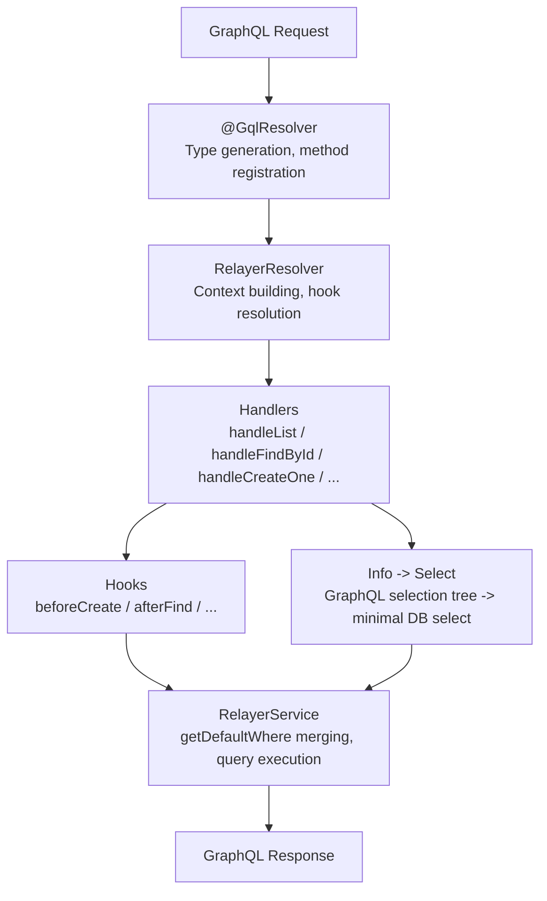

# @relayerjs/nestjs-graphql

Full-featured GraphQL CRUD for NestJS on top of [Relayer](https://github.com/nicepkg/relayer), an ORM-agnostic database layer. Define a Drizzle schema, add an entity class, drop it into a resolver and get a complete code-first GraphQL API with filtering, dual pagination, aggregation, and lifecycle hooks.

---

## Features

🧱 **Built on Relayer's core** - ORM-agnostic by design. Currently supports Drizzle ORM only, as we are in early development.

⚡ **Full-featured GraphQL CRUD** - One `@GqlResolver` decorator generates queries, mutations, and all GraphQL types. Zero boilerplate.

📄 **Dual pagination** - Cursor-based (Relay-style connections) and offset-based pagination, or both at once.

🔥 **Rich filtering** - AND/OR/NOT combinators, relation filters (some/every/none), per-type operators, case-insensitive mode.

📊 **Aggregation** - groupBy, count, sum, avg, min, max with full type safety.

🎯 **Selection optimization** - Reads the GraphQL info tree and fetches only the requested fields from the database.

## Table of Contents

- [Installation](#installation)
- [Quick Start](#quick-start)
- [Architecture](#architecture)
- [Resolver Configuration](#resolver-configuration)
- [Pagination](#pagination)
- [Filtering](#filtering)
- [Ordering](#ordering)
- [Aggregation](#aggregation)
- [Lifecycle Hooks](#lifecycle-hooks)
- [Typed Context](#typed-context)
- [Field Selection](#field-selection)
- [Module Options](#module-options)

## Installation

```bash
npm install @relayerjs/nestjs-graphql @relayerjs/core @relayerjs/drizzle @relayerjs/nestjs-common
```

Assumes a working NestJS GraphQL setup (`@nestjs/graphql`, `@nestjs/apollo`, `graphql`, `graphql-scalars`, and their peer dependencies).

## Quick Start

### 1. Define entities

```ts
// entities/post.entity.ts
import { createRelayerEntity } from '@relayerjs/drizzle';

import * as schema from '../schema';

export class PostEntity extends createRelayerEntity(schema, 'posts') {}
```

```ts
// entities/user.entity.ts
const UserBase = createRelayerEntity(schema, 'users');

export class UserEntity extends UserBase {
  @UserBase.computed({
    resolve: ({ table, sql }) => sql`${table.firstName} || ' ' || ${table.lastName}`,
  })
  fullName!: string;
}
```

### 2. Create an entity map

The entity map ties your entity classes together and enables cross-entity type inference:

```ts
// entities/entity-map.ts
export const entities = { users: UserEntity, posts: PostEntity };
export type EM = typeof entities;
```

### 3. Register the module

```ts
@Module({
  imports: [
    RelayerGraphqlModule.forRoot({
      db,
      schema,
      entities: [UserEntity, PostEntity],
      defaultRelationLimit: 50,
    }),
    UsersModule,
    PostsModule,
  ],
})
export class AppModule {}
```

`RelayerGraphqlModule` auto-configures Apollo Server with code-first schema generation. No schema files needed.

### 4. Create a service

```ts
@Injectable()
export class UsersService extends RelayerService<UserEntity, EM> {
  constructor(@InjectRelayer() r: RelayerInstance<EM>) {
    super(r, UserEntity);
  }
}
```

### 5. Create a resolver

```ts
@GqlResolver(UserEntity, { name: 'User' })
export class UsersResolver extends RelayerResolver<UserEntity, EM> {
  constructor(usersService: UsersService) {
    super(usersService);
  }
}
```

That's it. One decorator, full GraphQL CRUD:

| Type     | Name                       | Description                        |
| -------- | -------------------------- | ---------------------------------- |
| Query    | `users`                    | Cursor-paginated list (Connection) |
| Query    | `user(id: ID!)`            | Find by ID                         |
| Query    | `usersCount(where: ...)`   | Count matching records             |
| Query    | `usersAggregate(...)`      | Aggregation with groupBy           |
| Mutation | `createUser(data: ...)`    | Create one                         |
| Mutation | `updateUser(id: ID!, ...)` | Update one                         |
| Mutation | `deleteUser(id: ID!)`      | Delete one                         |

All GraphQL types are generated automatically: `User`, `UserWhereInput`, `UserOrderByInput`, `CreateUserInput`, `UpdateUserInput`, `UserConnection`, `UserEdge`, `PageInfo`, `UserAggregate`, plus scalar filter inputs (`StringFilter`, `IntFilter`, etc.).

> Full working example with entities, services, resolvers, hooks, and typed context is available in [examples/nestjs-graphql](../../examples/nestjs-graphql).

## Architecture

Every GraphQL operation flows through a layered pipeline. Each layer is optional and independently overridable:



### What each piece does

**@GqlResolver** reads entity metadata at decoration time and generates all GraphQL types (ObjectType, inputs, connections, filters) plus resolver methods. Everything is ready before the app starts.

**RelayerResolver** is the runtime base class. It resolves hooks from the DI container and builds typed context from the incoming request.

**Handlers** execute the actual operations: list, findById, create, update, delete, count, aggregate. Each handler integrates hooks and traverses the GraphQL `info` tree to build a minimal select clause.

**RelayerService** is the data layer. It wraps a Relayer repository, applies business-level defaults (`getDefaultWhere`, `getDefaultOrderBy`), and executes queries via Drizzle.

## Resolver Configuration

A fully configured resolver:

```ts
@GqlResolver(PostEntity, {
  name: 'Post',
  hooks: PostHooks,
  queries: {
    list: { name: 'posts', pagination: 'both' },
    findById: { name: 'post' },
    count: { name: 'postsCount' },
    aggregate: { name: 'postsAggregate' },
  },
  mutations: {
    createOne: { name: 'createPost' },
    updateOne: { name: 'updatePost' },
    deleteOne: { name: 'deletePost' },
  },
  filterable: ['id', 'title', 'published', 'author'],
  orderable: ['id', 'title', 'createdAt'],
})
export class PostsResolver extends RelayerResolver<PostEntity, EM, AppContext, AppQueryContext> {
  constructor(postsService: PostsService) {
    super(postsService);
  }
}
```

### Config reference

| Option                    | Type                                | Default        | Description                                     |
| ------------------------- | ----------------------------------- | -------------- | ----------------------------------------------- |
| `name`                    | `string`                            | Entity name    | GraphQL type name prefix                        |
| `queries.list`            | `boolean \| { pagination?, name? }` | `true`, cursor | List query. Set `false` to disable              |
| `queries.list.pagination` | `'offset' \| 'cursor' \| 'both'`    | `'cursor'`     | Pagination strategy                             |
| `queries.findById`        | `boolean \| { name? }`              | `true`         | Find by ID query                                |
| `queries.count`           | `boolean \| { name? }`              | `true`         | Count query                                     |
| `queries.aggregate`       | `boolean \| { name? }`              | `true`         | Aggregate query                                 |
| `mutations.createOne`     | `boolean \| { name? }`              | `true`         | Create mutation                                 |
| `mutations.updateOne`     | `boolean \| { name? }`              | `true`         | Update mutation                                 |
| `mutations.deleteOne`     | `boolean \| { name? }`              | `true`         | Delete mutation                                 |
| `fields`                  | `{ include?, exclude? }`            | All fields     | Whitelist or blacklist fields in GraphQL schema |
| `filterable`              | `string[]`                          | All fields     | Fields allowed in `WhereInput`                  |
| `orderable`               | `string[]`                          | All fields     | Fields allowed in `OrderByInput`                |
| `hooks`                   | `class`                             | -              | Lifecycle hooks class (injectable)              |
| `idField`                 | `string`                            | `'id'`         | Primary key field name                          |
| `idType`                  | `'number' \| 'string'`              | `'number'`     | Primary key GraphQL type (`ID` scalar)          |

### Disabling operations

```ts
@GqlResolver(PostEntity, {
  mutations: { deleteOne: false },
  queries: { aggregate: false },
})
```

### Default naming

For `name: 'Post'`:

| Operation | Default name     |
| --------- | ---------------- |
| list      | `posts`          |
| findById  | `post`           |
| count     | `postsCount`     |
| aggregate | `postsAggregate` |
| createOne | `createPost`     |
| updateOne | `updatePost`     |
| deleteOne | `deletePost`     |

When `pagination: 'both'`, two list queries are generated: `posts` (cursor) and `postsOffset` (offset).

## Pagination

### Cursor-based (default)

Relay-compatible connections with edges, cursors, and page info:

```graphql
query {
  users(
    first: 10
    after: "eyJ..."
    where: { fullName: { contains: "Alice" } }
    orderBy: [{ createdAt: desc }]
  ) {
    edges {
      node {
        id
        firstName
        lastName
        fullName
      }
      cursor
    }
    pageInfo {
      hasNextPage
      hasPreviousPage
      startCursor
      endCursor
    }
    totalCount
  }
}
```

`totalCount` is lazy - the count query only runs if the client includes it in the selection.

### Offset-based

Classic limit/offset pagination:

```graphql
query {
  postsOffset(
    limit: 20
    offset: 0
    where: { published: { eq: true } }
    orderBy: [{ createdAt: desc }]
  ) {
    items {
      id
      title
      published
    }
    totalCount
    hasMore
  }
}
```

### Both at once

Set `pagination: 'both'` to generate both queries simultaneously. Cursor pagination uses the base name (`posts`), offset gets the `Offset` suffix (`postsOffset`).

## Filtering

Type-safe `where` inputs with rich operators, logical combinators, and relation filters:

```graphql
query {
  posts(
    where: {
      AND: [
        { title: { contains: "GraphQL", mode: insensitive } }
        { published: { eq: true } }
        { author: { email: { endsWith: "@company.com" } } }
      ]
    }
  ) {
    edges {
      node {
        id
        title
      }
    }
  }
}
```

### Filter operators

| Filter          | Operators                                                                    |
| --------------- | ---------------------------------------------------------------------------- |
| `StringFilter`  | eq, ne, in, notIn, contains, startsWith, endsWith, like, ilike, isNull, mode |
| `IntFilter`     | eq, ne, gt, gte, lt, lte, in, notIn, isNull                                  |
| `FloatFilter`   | eq, ne, gt, gte, lt, lte, in, notIn, isNull                                  |
| `BooleanFilter` | eq, ne, isNull                                                               |
| `DateFilter`    | eq, ne, gt, gte, lt, lte, in, notIn, isNull                                  |
| `IDFilter`      | eq, ne, in, notIn, isNull                                                    |
| `JsonFilter`    | eq, isNull                                                                   |

`StringFilter` supports a `mode` field (`default` | `insensitive`) for case-insensitive matching.

### Logical combinators

`AND`, `OR`, `NOT` - fully nestable:

```graphql
where: {
  OR: [
    { title: { contains: "NestJS" } }
    { AND: [
      { published: { eq: true } }
      { NOT: { authorId: { eq: 1 } } }
    ]}
  ]
}
```

### Relation filters

For has-many relations, filter by related records:

```graphql
where: {
  comments: { some: { content: { contains: "helpful" } } }
}
```

| Mode     | Meaning                              |
| -------- | ------------------------------------ |
| `some`   | At least one related record matches  |
| `every`  | All related records match            |
| `none`   | No related records match             |
| `exists` | `true` = has any, `false` = has none |

Use `filterable` in the resolver config to control which fields appear in `WhereInput`. Computed and derived fields are filterable too.

## Ordering

Sort by multiple fields, including nested relations:

```graphql
query {
  posts(orderBy: [{ createdAt: desc }, { title: asc }]) {
    edges {
      node {
        id
        title
        createdAt
      }
    }
  }
}
```

Nested ordering through to-one relations:

```graphql
query {
  posts(orderBy: [{ author: { lastName: asc } }]) {
    edges {
      node {
        id
        title
      }
    }
  }
}
```

`SortOrder` enum: `asc`, `desc`. Use `orderable` in the resolver config to whitelist sortable fields.

## Aggregation

```graphql
query {
  postsAggregate(
    where: { published: { eq: true } }
    groupBy: ["authorId"]
    _count: true
    _avg: { authorId: true }
    _min: { createdAt: true }
    _max: { createdAt: true }
  ) {
    data
  }
}
```

sum and avg accept numeric fields only. min, max, and count accept all scalar fields.

## Lifecycle Hooks

Hooks fire around each operation. They are injectable, receive fully typed arguments, and can modify data in-flight:

```ts
@Injectable()
export class PostHooks extends RelayerHooks<PostEntity, EM, AppContext> {
  private readonly logger = new Logger(PostHooks.name);

  afterFind(entities: PostEntity[], ctx: AppContext): void {
    this.logger.log(`Found ${entities.length} posts (user ${ctx.currentUser?.id ?? 'anon'})`);
  }

  afterCreate(entity: PostEntity, ctx: AppContext): void {
    this.logger.log(`Post created: ${entity.id}`);
  }

  afterUpdate(entity: PostEntity, ctx: AppContext): void {
    this.logger.log(`Post updated: ${entity.id}`);
  }

  afterDelete(entity: PostEntity, ctx: AppContext): void {
    this.logger.log(`Post deleted: ${entity.id}`);
  }
}
```

Register in resolver config and module providers:

```ts
@GqlResolver(PostEntity, { hooks: PostHooks })
```

| Hook              | Arguments            | Can modify result?     |
| ----------------- | -------------------- | ---------------------- |
| `beforeCreate`    | `(data, ctx)`        | Return modified data   |
| `afterCreate`     | `(entity, ctx)`      |                        |
| `beforeUpdate`    | `(data, where, ctx)` | Return modified data   |
| `afterUpdate`     | `(entity, ctx)`      |                        |
| `beforeDelete`    | `(where, ctx)`       |                        |
| `afterDelete`     | `(entity, ctx)`      |                        |
| `beforeFind`      | `(options, ctx)`     |                        |
| `afterFind`       | `(entities, ctx)`    | Return modified list   |
| `beforeFindOne`   | `(options, ctx)`     |                        |
| `afterFindOne`    | `(entity, ctx)`      | Return modified entity |
| `beforeCount`     | `(options, ctx)`     |                        |
| `beforeAggregate` | `(options, ctx)`     |                        |
| `afterAggregate`  | `(result, ctx)`      | Return modified result |

## Typed Context

Override `buildContext` and `buildQueryContext` in the resolver to extract request data and pass it through the entire pipeline:

```ts
interface AppContext {
  request: unknown;
  currentUser: { id: number; role: 'admin' | 'user' };
}

interface AppQueryContext {
  currentUserId: number;
  isAdmin: boolean;
}

@GqlResolver(PostEntity, { name: 'Post' })
export class PostsResolver extends RelayerResolver<PostEntity, EM, AppContext, AppQueryContext> {
  constructor(postsService: PostsService) {
    super(postsService);
  }

  protected buildContext(req: unknown): AppContext {
    const request = req as { headers?: Record<string, string> };
    const userId = Number(request?.headers?.['x-user-id'] ?? '0');
    const role = (request?.headers?.['x-user-role'] ?? 'user') as 'admin' | 'user';
    return { request, currentUser: { id: userId, role } };
  }

  protected buildQueryContext(ctx: AppContext): AppQueryContext {
    return {
      currentUserId: ctx.currentUser.id,
      isAdmin: ctx.currentUser.role === 'admin',
    };
  }
}
```

The query context is forwarded to the service, where `getDefaultWhere` can use it for row-level scoping:

```ts
@Injectable()
export class PostsService extends RelayerService<PostEntity, EM, AppQueryContext> {
  constructor(@InjectRelayer() r: RelayerInstance<EM>) {
    super(r, PostEntity);
  }

  protected getDefaultWhere(
    upstream?: Where<PostEntity, EM>,
    ctx?: AppQueryContext,
  ): Where<PostEntity, EM> | undefined {
    if (!ctx || ctx.isAdmin) return upstream;
    const scoped: Where<PostEntity, EM> = {
      OR: [{ published: true }, { authorId: ctx.currentUserId }],
    };
    return upstream ? { AND: [upstream, scoped] } : scoped;
  }
}
```

This scoping applies to **every** operation: reads, writes, counts, aggregates. A non-admin trying to update or delete someone else's post gets a no-op because the scoped where filters it out before the SQL runs.

## Field Selection

### Include / Exclude

Control which entity fields are exposed in the GraphQL schema:

```ts
@GqlResolver(UserEntity, {
  fields: { exclude: ['password', 'refreshToken'] },
})
```

Or use `include` for a whitelist approach:

```ts
@GqlResolver(UserEntity, {
  fields: { include: ['id', 'firstName', 'lastName', 'fullName', 'email'] },
})
```

### Automatic selection optimization

The package traverses the GraphQL `info` tree and translates the client's selection set into a minimal Relayer `select` clause. Only the fields the client actually requested are fetched from the database. Relations are loaded only when selected. This is automatic, no configuration needed.

## Module Options

| Option                 | Type                      | Required | Default | Description                             |
| ---------------------- | ------------------------- | -------- | ------- | --------------------------------------- |
| `db`                   | Drizzle instance          | Yes      | -       | Drizzle database connection             |
| `schema`               | `Record<string, unknown>` | Yes      | -       | Drizzle schema (tables + relations)     |
| `entities`             | `RelayerEntityClass[]`    | Yes      | -       | Entity classes to register              |
| `maxRelationDepth`     | `number`                  | No       | -       | Max depth for nested relation loading   |
| `defaultRelationLimit` | `number`                  | No       | -       | Default limit for relation arrays       |
| `graphql`              | `Record<string, unknown>` | No       | `{}`    | Overrides for `GraphQLModule.forRoot()` |

The `graphql` overrides are spread into the Apollo driver config, so you can pass `playground`, `introspection`, `cors`, etc.

## License

MIT
